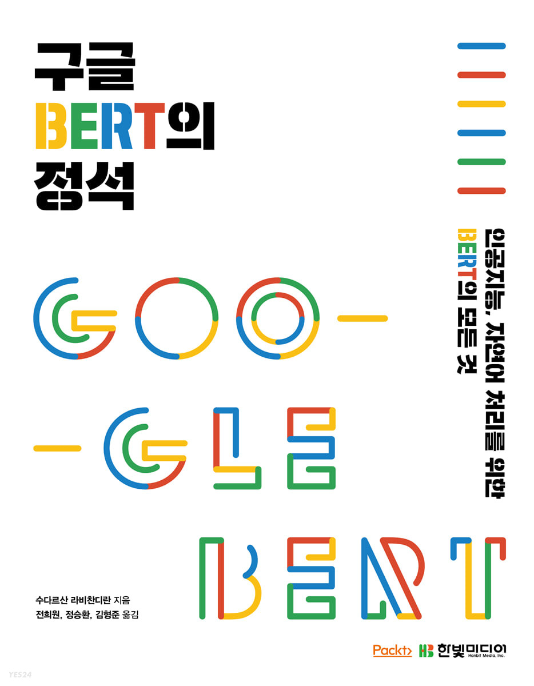

# 구글 BERT의 정석

### What is this book about?
 BERT (bidirectional encoder representations from transformer) has
revolutionized the world of natural language processing (NLP) with
promising results. This book is an introductory guide that will 
help you get to grips with Google's BERT architecture. With a detailed
explanation of the transformer architecture, this book will help you 
understand how the transformer’s encoder and decoder work.

 You'll explore the BERT architecture by learning how the BERT model 
is pre-trained and how to use pre-trained BERT for downstream tasks 
by fine-tuning it for NLP tasks such as sentiment analysis and text 
summarization with the Hugging Face transformers library. As you advance,
you’ll learn about different variants of BERT such as ALBERT, RoBERTa,
and ELECTRA, and look at SpanBERT, which is used for NLP tasks like question
answering. You'll also cover simpler and faster BERT variants based on 
knowledge distillation such as DistilBERT and TinyBERT. The book takes you
through MBERT, XLM, and XLM-R in detail and then introduces you to sentence
-BERT, which is used for obtaining sentence representation. Finally, you'll
discover domain-specific BERT models such as BioBERT and ClinicalBERT, and 
discover an interesting variant called VideoBERT.

 By the end of this BERT book, you’ll be well-versed with using BERT and its 
 variants for performing practical NLP tasks.