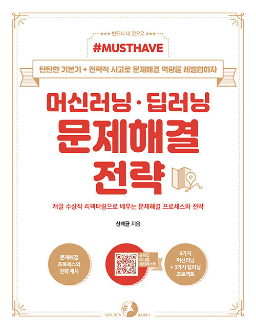

# 기술서 구현

#### 머신러닝 딥러닝 문제 해결 전략

##### 이 시리즈는 총 3권으로 나눠져 있고 1편엔 머신러닝의 기본 구조와 신경망의 
##### 연산법, 기초 지식을 습득할 수 있도록 구성되어 있고 책 후반에는 MNIST데이
##### 터셋을 이용한 이미지 처리에 관한 내용을 다룬다. 2편에는 1편의 내용을 
##### 복습한 뒤에 자연어 처리에 대하여 학습한다.

